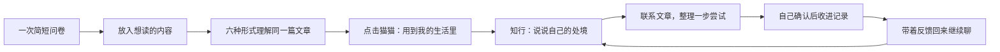

<div align="center">
  
  <h1>知径 × 知行</h1>
  <p><strong>从读懂一篇文章，到把理解带进生活。</strong></p>
  <p>Plan B · 独立演示版</p>
</div>


知径帮助读者找到进入长文的方式；知行接着问：**这个想法，与你眼前的生活有什么关系？**

收藏、读懂和真正用上，是三件不同的事。我们希望在文章之外留出一个空间：让读者说说自己的处境，结合文章理一理，留下可以试的一步，再带着真实反馈回来。

> 当前是可运行的演示，不依赖 AI。问卷使用规则模板，文章入口打开预置学习作品，知行使用三条人工编写的分支对话；不会根据任意输入实时生成答案。

## 从理解到尝试



### 页面跟着对话展开

知行不是另一个摆满固定面板的后台。新场景先呈现一句邀请和输入框；对话出现时页面自然伸展，形成做法后展开行动卡。历史、原文线索和个人记录按需打开，不要求用户先填完一整页表单。

再次回来，先看到上次留下的一步和反馈，旧对话可展开。动画帮助表达展开与收起，支持系统“减少动态效果”；不靠打卡、倒计时和惩罚催促用户。

### 三者如何结合

| 内容 | 扮演的角色 | 当前状态 |
| --- | --- | --- |
| 用户的处境 | 决定讨论什么、先试哪一步 | 可输入、保存，按选择进入预设分支 |
| 文章里的知识 | 提供可回看的观点与原文依据 | 已接入同一案例的原文锚点 |
| 可追溯的相似经历 | 对照不同条件、做法与代价 | 设计方向，尚未接入检索或真实人物样本 |

别人的经历不是你的标准答案。未来补充知乎经验或相关文章时，需要说明来源、相似与不同、填补什么缺口；找不到就不编造。

## 开始运行

Node.js 24；在本目录执行：

```sh
git clone https://github.com/lizx-lzx/zhijing-plan-b.git
cd zhijing-plan-b
npm ci
npm run demo:install
npm run demo:build
npm run dev:plan-b
```

打开 [Plan B 欢迎页](http://localhost:3100/zhijing/?start=welcome) 或 [问卷](http://localhost:3100/zhijing/?start=questionnaire)。

`dev:plan-b` 在前台同时启动网页和 API，退出终端或 Ctrl+C 停止；不安装自启动服务。
端口已被占用时拒绝启动，不连接到别的项目。

**问卷与文章入口走演示流程，不需要模型密钥。** 第 8 题点击「进入待启集」，立即使用已有规则模板保存所选偏好，直接进入内容输入页；不请求 AI、不出现第二个 Skill 确认页。原有「读法笺」仍可主动编辑。
已有文章案例与知行预设对话可直接体验，不需要模型密钥。小猫原有自由聊天、新内容生成等其他 AI 能力仍需要单独配置模型，不能把演示可用等同于这些能力已接通。
欢迎页不再展示案例卡片；从问卷进入待启集，放入内容并点击「开始体验」后进入预置学习作品。体验后的作品仍保留在「上回读到」，方便继续。

## 知行怎么体验

1. 在学习页点击猫猫，再点「用到我的生活里」。不另外增加读完弹窗。
2. 进入独立页面，选“把 AI 用进工作”“学了不少，还是用不上”或“看完后有点焦虑”，也可先写下自己的处境。回复为预设演示，不分析任意新问题，也不编造知乎人物经历。
3. 继续选择具体情境、缩小行动或复盘。建议不是自动任务；点击「整理后收进知行」，编辑后确认才进入私人知识记录。
4. 「文章线索」「我的记录」按需展开，可查看原句、记录理解与实践反馈。修改保留版本，不改变原文和长期学习 Skill。
5. 刷新或从猫猫重新进入，先看到「接着上次」；「我的知行」可查找其他场景。返回文章仍保留学习形式和时间位置。

直接打开 [知行](http://localhost:3100/zhijing/zhixing/) 会回到最近的场景；需要本地网页和 API 均在运行。记录存储在本副本 SQLite 中，不只是页面缓存；同一访客会话可持续使用，沿用恢复码机制转移访问，不承诺未部署的跨设备访问或服务器永不离线。

## 与原版隔离

| 项目       | Plan B                                                                    |
| ---------- | ------------------------------------------------------------------------- |
| 起点       | 原知径 `17d7d50225fa7cfce2061a62454c8422a90c0eb8`                         |
| Git        | 独立公开仓库 `lizx-lzx/zhijing-plan-b`，保留原版历史；`codex/plan-b`       |
| 网页 / API | `localhost:3100` / `127.0.0.1:4430`                                       |
| 数据       | 本目录 `data-plan-b/`，不带原版账户、恢复码或作品记录                     |
| 会话       | `zhijing_plan_b_session`，不覆盖原版 Cookie；不同网页端口也隔离浏览器存储 |
| 配置       | 本目录 `.env.plan-b`；拒绝导入其他项目的配置或数据目录                    |
| 部署       | B 版尚未部署公网。原站点、原 GitHub 仓库与服务器不变                        |

因为现有案例沿用 `/zhijing/` 相对路径，本地保持此路径，但使用不同网页源；它不是原站点的线上副本地址。

## 下一阶段

见 [Plan B 产品边界与开发顺序](docs/PLAN-B.md)。已确认：从学习页可主动进入新的独立对话页；结合用户困境、文章知识、可追溯的类似经历，必要时补充方法或其他文章。不能强制读完、强制行动，也不把推荐变成新的信息堆积。

## 技术与源码

- React 19、TypeScript、Vinext / Vite；Motion 表达对话与卡片的进入，CSS 控制自然展开的页面。
- Node API + SQLite 分别保存场景、对话、用户确认的知识记录与修订。没有把聊天自动写进长期学习画像。
- 已有文章播放器共享章节、时间和原文位置；进入知行时保留回程位置。

| 入口 | 代码 |
| --- | --- |
| 知行页面与动态展开 | [zhixing-space.tsx](components/zhixing-space.tsx)、[zhixing.css](app/zhixing.css) |
| 预设对话分支 | [zhixing-demo.mjs](server/zhixing-demo.mjs) |
| 原文与返回位置 | [zhixing-context.mjs](server/zhixing-context.mjs) |
| 私人场景与记录接口 | [zhixing.mjs](server/zhixing.mjs)、[store.mjs](server/store.mjs) |
| 猫猫唯一入口 | [reading-companion.tsx](components/reading-companion.tsx) |

源码与重建案例所需媒体随仓库提供；不包含密钥、用户数据库、恢复码、私人对话和本地依赖。GitHub 是源码入口，不是已部署的网站。当前测试验证功能与数据边界，**不证明个性化学习或行动建议已提升真实生活效果**。

## 验证与资料

```sh
npm run test:plan-b
npm run test:unit
npm run typecheck
npm run build:complete
```

原版的完整产品说明见 [原版 README](README.知径原版.md)，仅作为复制起点的历史背景，运行命令以本 README 为准。
文章、图片、音视频、小猫等素材保留原有来源及权利边界，见 [THIRD-PARTY.md](THIRD-PARTY.md)。
