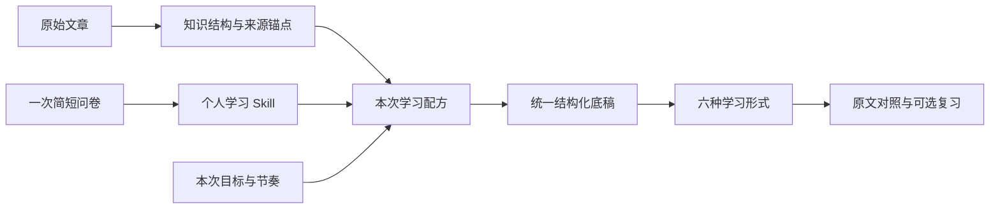

<div align="center">
  
  <h1>知径 · Zhijing</h1>
  <p><strong>把一篇知乎长文，编译成一条属于你的理解路径。</strong></p>
  <p>先认识你，再为你讲知识。</p>
  <p>
    <a href="https://app.chainvalley.top/zhijing/?start=welcome">从头体验</a> ·
    <a href="#开始运行">本地运行</a> ·
    <a href="docs/21-运行与完整打包.md">部署与打包</a> ·
    <a href="CONTRIBUTING.md">继续打磨</a>
  </p>
</div>


[项目 Icon · PNG](public/brand/zhijing-icon.png) · [Icon · SVG](public/brand/zhijing-icon.svg) · [项目封面](public/og.png)

## 为什么做知径

知乎上有许多写得认真、信息密度很高的长文。但从“看到一篇好文章”到“真正读懂它”，中间还隔着一段路：**收藏没看、看了没懂、合上就忘。**

把八千字压成几段摘要，或者把文字换成视频，能改变阅读成本，却未必回答那个更重要的问题：这篇文章，能不能让眼前这个人读懂，并成为他自己的理解？

知径围绕这个问题，设计一个**个性化学习编译器**。它不只转换内容格式，而是结合文章本身、读者的个人学习 Skill 和本次目标，重新组织进入方式、讲解顺序、重点与节奏。

> 当前在线体验为预置文章演示：输入内容后进入《窗口期可能只剩五年》的既有学习作品，并非针对本次输入即时生成。真实生成代码与演示入口的区别，见下方「当前版本与验证边界」。

## 从偏好到理解路径

个人学习 Skill 是一组**用户能看见、能修改的讲解规则**，不是藏在后台的“学习类型”标签。问卷选择和用户补充是规则的依据；系统不能仅凭年龄或偏好断言一个人的能力，也不能假定他熟悉某个主题。

同样选择视频的人，也可能需要完全不同的开头：有人想先听一个具体故事，有人想先知道核心结论，有人想先看整体脉络，还有人愿意从一个有意思的问题开始。



这里的“学习配方”，指个人规则与当前内容、临时调整共同形成的编排约束。比如，同样想“看懂它”，紧凑模式先抓关键，慢讲模式则补足必要前置、把难点拆小；两者都应保留让结论成立的条件。

## 怎样使用

产品围绕“一篇文章，完成一次学习”组织，而不是先让用户管理一套复杂的学习计划。

1. **认识你的读法。** 8 题分为 3 组，了解年龄阶段、目标、形式偏好、讲解入口、难点帮助、节奏、互动和希望照顾的地方。默认只需完成一次，之后可在「读法笺」修改。
2. **放入想读的内容。** 在「待启集」放入知乎链接、正文或文本文件。「这次读法」可以临时调整主要形式、目标、讲解入口和节奏，不自动覆盖长期规则。
3. **按自己的方式开始。** 可以只选主要形式，也可以多选或全选六种形式；进入作品后直接打开主要形式，不要求再选一次。真实生成链路按所需形式制作，其他媒体可随后补充；当前演示直接使用已有作品。
4. **卡住时换一种讲法。** 切换形式时围绕同一章节继续。桌面左侧完整展示原文，并高亮当前讲解对应的句子；手机通过原文入口对照。小猫可拖动，点击后在身旁的对话框交流。
5. **随时停下，下次接着读。** 「接着上次继续」保留案例入口与进度；互动中的复习卡可以先隐藏答案，自己回忆后再展开，不答题也能读完整篇。

服务端另有「知藏」学习库、标题搜索、作品与进度保存、私人恢复码接口。恢复码用于恢复服务端账户下的资料；**预置案例保存在当前浏览器的进度，不等同于跨设备同步**。

### 一篇内容，六种形式

| 形式 | 帮你怎样理解 |
| --- | --- |
| 图文 | 自己掌握速度，结合解释、例子和原文细读。 |
| 逐章图解 | 把一章里的因果、对比、步骤和关键关系摆出来。 |
| 全文全景图 | 先看中心问题与全文脉络，再回到局部。 |
| 音频 | 用耳朵听讲解，适合散步或通勤。 |
| 视频 | 让画面、配音、字幕和讲解节奏配合起来。 |
| 互动 | 通过情境判断、推演与复习卡参与理解，答案可查看。 |

六种形式是同一份内容的不同入口，不是六套彼此无关的答案。选择视频为主，也不意味着之后只能看视频。


界面采用宣纸留白、朱红点缀和温馨书房。动效用于表达变化、反馈操作；陪读小猫提供帮助，不靠打卡、排名或惩罚制造负担。

<details>
<summary>看看手机上的陪读小猫</summary>
<br />

</details>

## 六层学习编译链路

以下六层是逻辑职责划分，不是六个独立服务。“学习配方”目前由本次规则快照与编排输入共同承载。

| 分层 | 输入与产出 | 主要代码 |
| --- | --- | --- |
| 内容获取 | 接收链接或正文，整理原始文本，建立可回溯的段落锚点。 | [source.mjs](server/source.mjs) |
| 内容分析 | 将原文拆成中心问题、概念、事实与推断、因果与对比、案例与情绪等知识结构。 | [analyze-content.md](server/prompts/analyze-content.md)、[model.mjs](server/model.mjs) |
| 个人学习 Skill | 将问卷转成可见、可修改的规则，记录规则依据并保存版本。 | [domain.ts](lib/domain.ts)、[design-learning-skill.md](server/prompts/design-learning-skill.md) |
| 学习配方 | 结合个人 Skill、文章特点与本次调整，形成只对这次学习生效的编排约束。 | [profileForLesson](lib/domain.ts)、[任务创建与处理](server/index.mjs) |
| 学习作品生成 | 生成统一结构化底稿，核对来源引用，区分原文陈述、AI 解释和教学虚构，再交给不同渲染器。 | [model.mjs](server/model.mjs)、[study-content.mjs](server/study-content.mjs)、[media.mjs](server/media.mjs) |
| 学习呈现与反馈 | 组织六种形式，关联章节与原文，保存学习位置并提供互动帮助。 | [学习页面](components/learning-lesson.tsx)、[案例播放器](experiments/openmaic-preview/main.jsx)、[陪读接口](server/companion.mjs) |

来源不是页面末尾补上的一个链接。章节与解释需要关联到原文段落；引用检查不通过时要修复或报错，而不是编造出处。独立核对环节检查内容忠实性与引用，**不等于已经完成外部事实认证**。

### 技术实现

| 部分 | 实现方式 |
| --- | --- |
| 前端 | React 19、TypeScript、Vinext / Vite；手写 CSS 为主，Motion 与已接入的 ReactBits 组件用于动效。 |
| 后端 | 独立 Node.js API + SQLite，保存访客会话、来源、Skill 版本、任务、作品、进度和反馈。 |
| 生成 | Skill 设计、内容分析、个性化编排、独立核对四类职责；编排与核对分别有讲解底稿和扩展学习内容的提示词。 |
| 媒体 | 配音接口、Playwright 画面录制 / 渲染、FFmpeg 音视频与字幕合成；仓库附带已制作的案例媒体。 |
| 部署 | 自有服务器，systemd + Nginx 子路径部署；生成队列串行处理，配有限额、版本化发布和失败回退脚本。 |

OpenMAIC 的部分生成与渲染包用于作品环节，并非直接套用其完整课堂产品；具体代码和素材来源见 [第三方说明](THIRD-PARTY.md)。

## 为什么从知乎开始

知乎沉淀了大量围绕真实问题展开、值得细读的知识长文。读者搜到一个问题、找到一篇长答之后，仍然需要把它真正搞明白。知径希望接住的，就是这一步。

同一篇文章，有人只想“先看懂它”，有人希望“理清来龙去脉”，有人想“记住几个重点”，有人需要“知道怎么用”，也有人想“能讲给别人听”。这些是问卷里的具体目标，而不是笼统地给用户划分类型。

- **对读者：** 降低长文的启动与理解门槛，让收藏的内容有机会被重新打开，按当下的需要学习。
- **对创作者：** 为复杂观点增加图解、音频、视频等理解入口，同时保留原文与作者表达的出处。
- **对社区：** 探索从“找到好内容”到“理解、吸收并继续讨论”的衔接，而不是增加一层信息过载。

这些是项目希望创造的价值，不是已经测得的完成率、理解度或平台增长数据。知径不替代原文，也不代表已经与知乎建立官方合作或用户数据共享。

## 当前版本与验证边界

**可以直接体验的，是一份完整的预置文章作品。** 当前主站输入区固定使用演示模式：任何非空输入都会经过准备动画，进入既有的《窗口期可能只剩五年》案例。六形式切换、章节联动、左侧原文、小猫和继续阅读围绕这份作品运行；选择不同偏好不会实时重做这份案例。

**源码中保留了真实生成链路。** 包括文章提取、AI 学法设计、内容分析与编排、引用校验、配音、MP4 制作、服务端学习库及恢复接口。AI 学法设计、小猫对话和新内容生成需要有效模型 / 媒体服务配置。代码存在不等于当前演示入口已启用任意文章的端到端生产，也不保证所有知乎链接都能提取成功。

当前规则和测试覆盖了“相同媒体偏好、不同讲解入口产生不同编排指令”，以及“本次调整不改写长期规则”。这不等于已经证明生成质量稳定，更不等于证明个性化提升了学习效果。Skill 规则带有选择依据；目前没有实现独立的置信度评分。

完整原文、讲稿、图解、音轨、视频、字幕和动效资源随仓库提供，可重建案例；密钥、用户数据与私人音色参考不包含在内。运行和验证范围见 [交付说明](docs/21-运行与完整打包.md)。

接下来优先打磨：

- 用更多不同结构的文章检验内容解析、知识覆盖、来源对齐和讲解忠实性。
- 比较不同 Skill 下的讲解差异，检查开头、顺序、重点与节奏是否真正改变，而不是只换措辞。
- 用真实用户的理解、回忆与应用表现验证效果，不把喜欢某种形式当成学得更好的证据。
- 让视频画面服务于具体知识关系，并加强生成稳定性、容量评估、异地备份与恢复演练。

## 我们相信什么

**把选择权还给用户，但不把负担推给他。** 系统提供默认与推荐，用户随时可以调整；长期规则只在用户明确保存后更新。

**个性化必须可见、可纠正。** 一次没精神，不应该永久改变一个人的画像；没有问到的维度，也不能被当成已经知道。

**来源边界是产品结构的一部分。** 讲解、图解与视频都应能回到原文，分清作者的观点、推演和 AI 补充解释。

**先把一次学习做扎实。** 问答、复述和应用练习提供自愿参与的机会，不成为继续阅读的门槛。

知乎沉淀的是许多人的经验，知径想做的，是让这些经验更容易被下一个人接住。

## 开始运行

使用 **Node.js 24**，建议 macOS / Linux 或 Windows WSL。

```sh
git clone https://github.com/lizx-lzx/zhijing.git
cd zhijing
npm ci
npm run demo:install
cp .env.example .env.zhijing
npm run demo:build
```

分别在两个终端启动：

```sh
npm run api
```

```sh
npm run dev:demo
```

打开 [localhost:3000/zhijing](http://localhost:3000/zhijing/?start=welcome)。仅构建和浏览预置作品不需要重新生成媒体；模型配置与基础规则降级方式见[运行说明](docs/21-运行与完整打包.md)。

录演示时，在知径网页内按 **Option + Shift + R**（Mac）或 **Alt + Shift + R**（Windows），即可从问卷第 1 题重新开始；也可直接打开[固定问卷入口](https://app.chainvalley.top/zhijing/?start=questionnaire)。在问卷页刷新仍会打开问卷，不清空已保存的学法与作品；普通首页刷新仍保留老用户状态。从欢迎页开始则使用页面顶部的「从头体验」。

## 项目结构

```text
app/                         页面、布局与视觉样式
components/                  问卷、书房、学习页、原文、小猫
lib/                         学习规则、形式联动、路由与状态
server/                      内容提取、模型、配音、存储与 API
  prompts/                   各环节的提示词
experiments/
  openmaic-preview/          六形式文章作品及冻结媒体
  article-motion/            网页动效、渲染脚本与成片
public/                      图标、书房图片、小猫及静态资源
tests/ · scripts/            测试、验收与构建工具
deploy/                      自有服务器部署脚本
docs/                        产品思路、研究、设计与开发记录
```

## 从想法到现在

[产品决策](docs/01-对话思路与产品决策.md) · [开发与源码导航](docs/02-开发思路、最终方案与源码导航.md) · [研究依据](docs/03-研究结论与下一阶段落地方案.md) · [问卷与 Skill](docs/04-问卷与个人学习Skill映射-v0.2.md)

[宣纸留白](docs/14-宣纸留白视觉统一.md) · [界面减法](docs/10-界面减法.md) · [陪读小猫](docs/20-陪读小猫.md) · [完整运行与部署](docs/21-运行与完整打包.md)

历史文档记录各阶段状态；以本 README 和当前代码为准。GitHub 保存源码，线上仍部署在用户自有服务器，不会因推送而自动发布。

---

本仓库已公开，但尚未为全部内容选择统一开源许可证。文章、角色与依赖保留各自权利和来源；公开可见不代表所有素材均获统一再分发授权，详见 [第三方代码与素材说明](THIRD-PARTY.md)。
